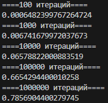
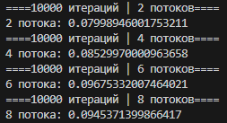
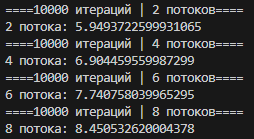
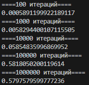
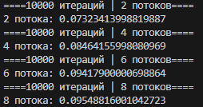
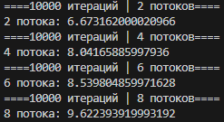
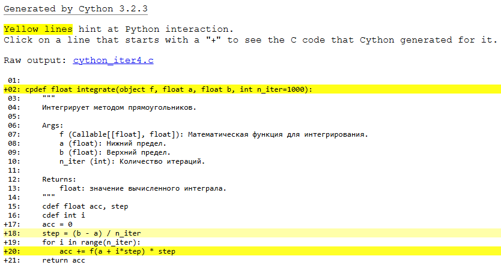

# Лабораторная работа 10. Методы оптимизации вычисления кода с помощью потоков, процессов, Cython, отпускания GIL #

## Цель работы: ##
Исследовать методы оптимизации вычисления кода, используя потоки, процессы, Cython и отключение GIL на основе сравнения времени вычисления функции численного интегрирования методом прямоугольников, реализованной на чистом Python.

## Ход работы ##

### Итерация 1 ###
Стартовая точка.
#### Файлы: ####
__iter1.py__ - основной файл с функцией, замером времени выполнения и доктестами. <br>
__test_iter1.py__ - файл с pytest'ами.
#### Результат: ####


### Итерация 2 ###
Оптимизация с помощью потоков.
#### Файлы: ####
__iter2.py__ - основной файл с функцией и замером времени выполнения.
#### Результат: ####


### Итерация 3 ###
Оптимизация с помощью процессов.
#### Файлы: ####
__iter3.py__ - основной файл с функцией и замером времени выполнения.
#### Результат: ####


### Итерация 4 ###
Профилирование и оптимизация функции integrate с помощью Cython.
#### Файлы: ####
__iter4.1.py__ - файл с измененной функцией 1 итерации и замером времени выполнения. <br>
__iter4.2.py__ - файл с измененной функцией 2 итерации и замером времени выполнения. <br>
__iter4.3.py__ - файл с измененной функцией 3 итерации и замером времени выполнения. <br>
__cython_iter4.pyx__ - файл с отпрофилированной основной функцией. <br>
__setup_iter4.py__ - файл для сборки. <br>
__setup_iter4_annotated.py__ - файл для сборки с аннотацией.
#### Результаты: ####
1 итерация <br>
 <br>
2 итерация <br>
 <br>
3 итерация <br>
 <br>
Аннотация для функции <br>


### Итерация 5 ###
Использование noGIL и Python 3.14. <br>
Запуск noGIL происходил с использованием команды ```python -X gil=0 ...``` 
#### Файлы: ####
__iter2.py__ - файл с функцией, использующей потоки и замером времени выполнения. <br>
__iter4.2.py__ - файл с измененной функцией 2 итерации и замером времени выполнения. <br>
#### Результаты: ####
Python, noGIL <br>
.png) <br>
Cython, noGIL <br>
.png) <br>
Python, 3.14 <br>
.png) <br>
Cython, 3.14 <br>
.png) <br><br>

Применение примитивов синхронизации имеет смысл только для защиты общих данных. Для процессов, Cython с отпусканием GIL и чистых вычислительных задач без разделяемого состояния они не нужны и даже вредны для производительности.

## Вывод ##
Наилучший результат показала комбинация потоков с Cython и отпусканием GIL, что позволило преодолеть ограничения GIL за счет истинного параллелизма. Использование процессов оказалось неэффективным из-за высоких накладных расходов на межпроцессное взаимодействие и копирование данных. Python 3.14 продемонстрировал недостаточный прирост производительности. Cython обеспечил значительное ускорение всех вычислительных функций благодаря компиляции в нативный код и оптимизациям на уровне C.