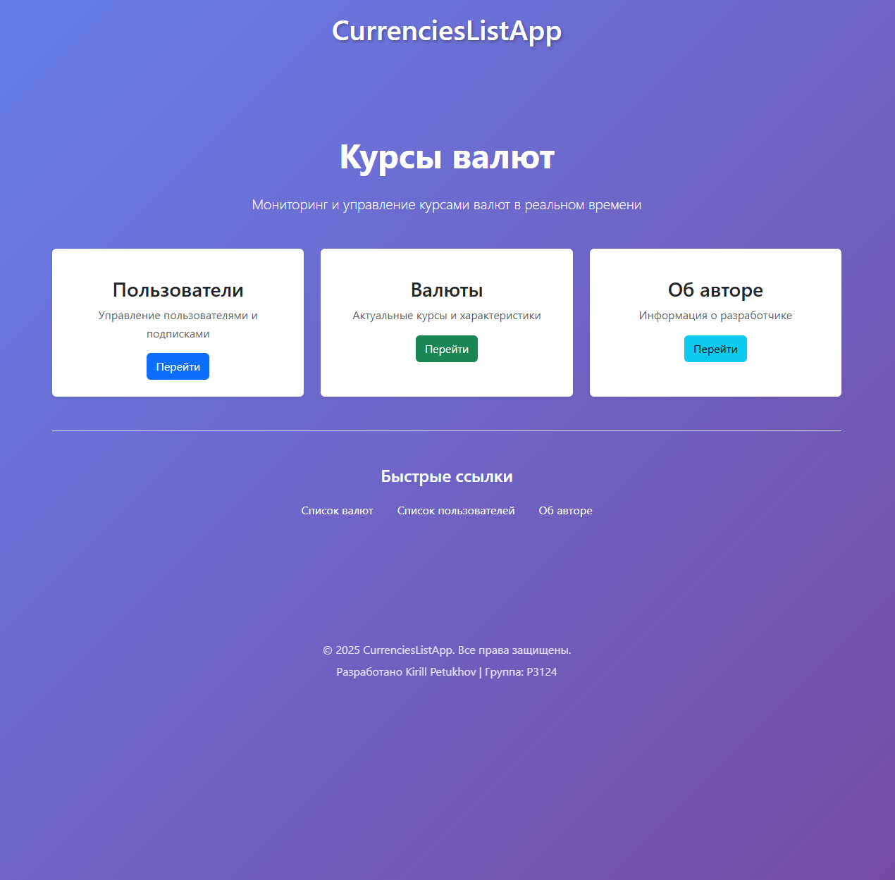
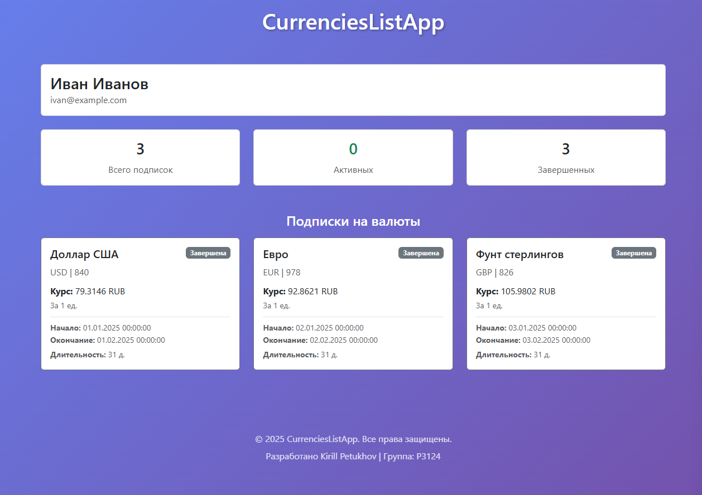
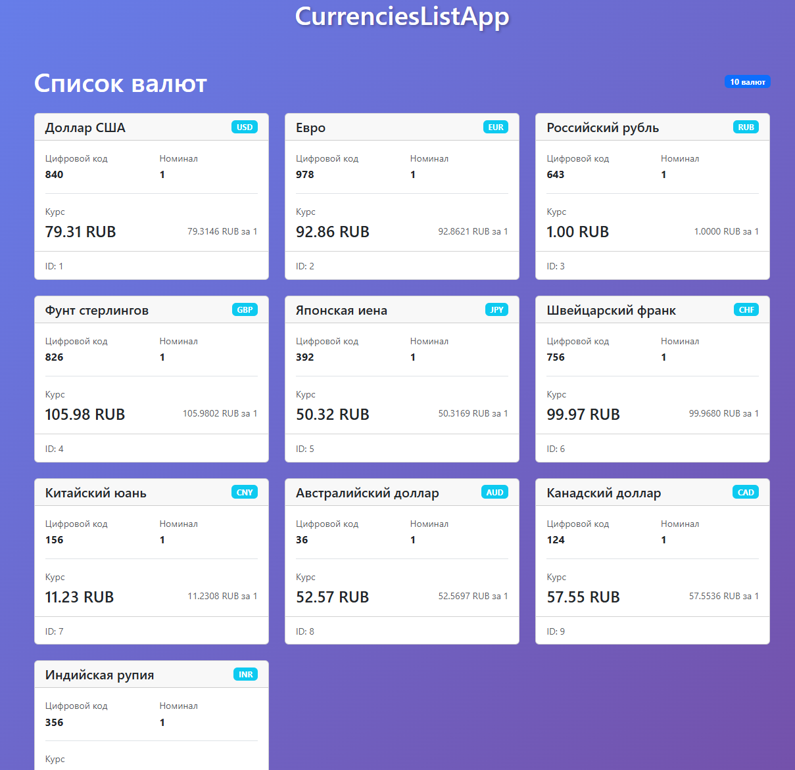
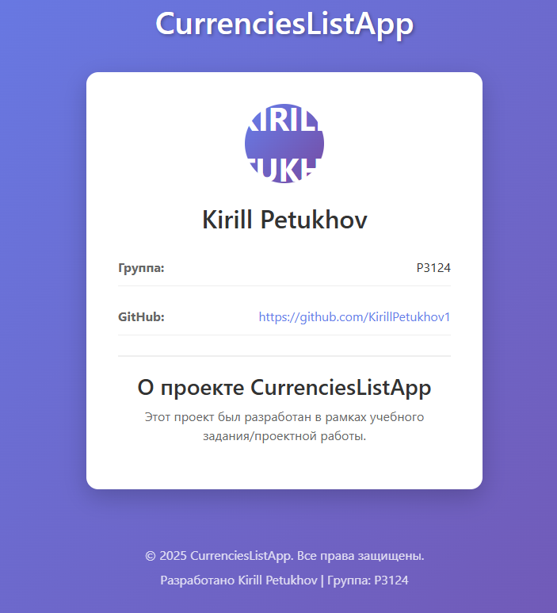
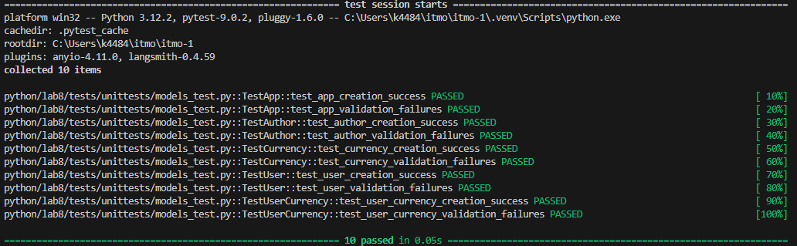
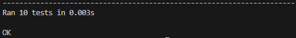

# Лабораторная работа 8. Клиент-серверное приложение на Python с использованием Jinja2 #

## 1. Цель работы
* Создать простое клиент-серверное приложение на Python без серверных фреймворков.
* Освоить работу с HTTPServer и маршрутизацию запросов.
* Применять шаблонизатор Jinja2 для отображения данных.
* Реализовать модели предметной области (User, Currency, UserCurrency, App, Author) с геттерами и сеттерами.
* Структурировать код в соответствии с архитектурой MVC.
* Получать данные о курсах валют через функцию get_currencies и отображать их пользователям.
* Реализовать функциональность подписки пользователей на валюты и отображение динамики их изменения.
* Научиться создавать тесты для моделей и серверной логики.

## 2. Описание предметной области
Реализованы следующие сущности:
*   **Author**: Автор приложения (имя, учебная группа).
*   **App**: Описание самого приложения (название, версия, автор).
*   **User**: Пользователь системы (идентификатор, имя).
*   **Currency**: Валютная единица (идентификатор, цифровой и буквенный код, название, курс, номинал). Данные получаются из внешнего API.
*   **UserCurrency**: Промежуточная сущность, реализующая связь «многие ко многим» между пользователями и валютами (подписки).

## 3. Структура проекта
myapp/ \
├── models/ #Модели \
│ ├── \_\_init\_\_.py \
│ ├── author.py \
│ ├── app.py \ 
│ ├── user.py \
│ ├── currency.py \
│ └── user_currency.py \
├── templates/ #Шаблоны View \
│ ├── components/ \
│ │ ├── author.html \
│ │ ├── currencies.html \
│ │ ├── footer.html \
│ │ ├── header.html \
│ │ ├── main.html \
│ │ ├── user.html \
│ │ └── users.html \
│ ├── components/ \
│ │ ├── author_page.html \
│ │ ├── currencies_page.html \
│ │ ├── main_page.html \
│ │ ├── user_page.html \
│ │ └── users_page.html \
│ └── index.html \
├── tests/unittests/ #Тесты \
│ └── models_test.py \
├── utils/ #Вспомогательные скрипты \
│ └── currencies_api.py.py \
├── myapp.py #Входная точка \
└── README.md \

## 4. Описание реализации

### 4.1 Реализация моделей
Для каждой модели в пакете `models` создан класс с приватными атрибутами, геттерами и сеттерами, включающими проверку типов данных.

**Пример (фрагмент модели `Currency`):**
```python
class Currency:
    """
    Модель, представляющая валюту с её характеристиками.
    """

    def __init__(self, id: int, num_code: int, char_code: str,
                 name: str, value: float, nominal: int) -> None:
        """
        Инициализирует объект Currency.

        Args:
            id (int): Уникальный идентификатор валюты
            num_code (int): Цифровой код валюты
            char_code (str): Символьный код валюты (ISO 4217)
            name (str): Название валюты
            value (float): Курс валюты
            nominal (int): Номинал (за сколько единиц валюты указан курс)

        Raises:
            ValueError: Если id пустая строка
            ValueError: Если num_code не в диапазоне 1-999
            ValueError: Если char_code не соответствует формату ISO 4217
            ValueError: Если name пустая строка
            ValueError: Если value <= 0
            ValueError: Если nominal <= 0
        """
        self.id = id
        self.num_code = num_code
        self.char_code = char_code
        self.name = name
        self.value = value
        self.nominal = nominal

    @property
    def char_code(self) -> str:
        """
        Returns:
            str: Символьный код валюты (ISO 4217)
        """
        return self.__char_code

    @char_code.setter
    def char_code(self, value: str) -> None:
        """
        Args:
            value (str): Символьный код валюты (ISO 4217)

        Raises:
            TypeError: Если value не является строкой
            ValueError: Если value не состоит из 3 латинских букв
        """
        if not isinstance(value, str):
            raise TypeError("Символьный код должен быть строкой")
        value = value.strip().upper()
        if len(value) != 3 or not value.isalpha():
            raise ValueError(
                "Символьный код должен состоять из 3 латинских букв")
        self.__char_code = value
```

### 4.2 Реализация сервера и маршрутизации
Сервер построен на базе классов `HTTPServer` и `BaseHTTPRequestHandler` из стандартной библиотеки. Внутри метода обработки запросов (`do_GET`) реализована простая маршрутизация на основе анализа `self.path`

```python
def do_GET(self):
    path = self.path.split('/')[1:]
    if path[0] == '':
        page = main_tm.render(myapp=app.name,
                                author=app.author,
                                )
        self.__send_ok_html_response(page)
    elif path[0] == 'users':
        page = users_tm.render(myapp=app.name,
                                author=app.author,
                                users=users
                                )
        self.__send_ok_html_response(page)
```

### 4.3 Использование шаблонизатора Jinja2
Для работы с шаблонами один раз при старте приложения инициализируется объект `Environment`. Он настраивается на загрузку шаблонов из папки `templates`, что обеспечивает кэширование и высокую производительность.

```python
env = Environment(
    loader=PackageLoader("myapp"),
    autoescape=select_autoescape()
)
```

### 4.4 Интеграция функции get_currencies
Функция `get_currencies` в модуле `utils/currencies_api.py` возвращает данные, которые преобразуются в объекты модели `Currency`.

## 5. Примеры работы приложения
### /

### /users

### /user?id=1

### /currencies

### /author


### Примеры вывода данных
```
server is running
127.0.0.1 - - [22/Dec/2025 19:55:14] "GET /currencies HTTP/1.1" 200 -
127.0.0.1 - - [22/Dec/2025 19:55:16] "GET / HTTP/1.1" 200 -
127.0.0.1 - - [22/Dec/2025 19:56:12] "GET /users HTTP/1.1" 200 -
[<models.user.User object at 0x000002DFBB10DF70>] 1 1 2 3 4 5 6 7 8 9 10
127.0.0.1 - - [22/Dec/2025 19:56:38] "GET /user?id=1 HTTP/1.1" 200 -
127.0.0.1 - - [22/Dec/2025 19:57:08] "GET / HTTP/1.1" 200 -
127.0.0.1 - - [22/Dec/2025 19:57:10] "GET /currencies HTTP/1.1" 200 -
127.0.0.1 - - [22/Dec/2025 19:57:45] "GET / HTTP/1.1" 200 -
127.0.0.1 - - [22/Dec/2025 19:57:46] "GET /author HTTP/1.1" 200 -
```

## 7. Тестирование
```python
class TestApp:
    """Тесты для модели App"""
    
    def test_app_creation_success(self):
        """Тест успешного создания объекта App"""
        author = Author("Иван Иванов", "ИТ-201", "https://github.com/ivanov")
        app = App("MyApp", "1.0.0", author)
        
        assert app.name == "MyApp"
        assert app.version == "1.0.0"
        assert app.author == author
    
    def test_app_validation_failures(self):
        """Тест валидации при создании App"""
        author = Author("Иван Иванов", "ИТ-201", "https://github.com/ivanov")
        
        with pytest.raises(ValueError, match="Название приложения не может быть пустым"):
            App("", "1.0.0", author)
        
        with pytest.raises(ValueError, match="Версия приложения не может быть пустой"):
            App("MyApp", "", author)
        
        with pytest.raises(TypeError, match="Автор должен быть объектом класса Author"):
            App("MyApp", "1.0.0", "not an author")


class TestAuthor:
    """Тесты для модели Author"""
    
    def test_author_creation_success(self):
        """Тест успешного создания объекта Author"""
        author = Author("Иван Иванов", "ИТ-201", "https://github.com/ivanov")
        
        assert author.name == "Иван Иванов"
        assert author.group == "ИТ-201"
        assert author.github_url == "https://github.com/ivanov"
    
    def test_author_validation_failures(self):
        """Тест валидации при создании Author"""
        with pytest.raises(ValueError, match="Имя должно содержать минимум 2 символа"):
            Author("И", "ИТ-201", "https://github.com/ivanov")
        
        with pytest.raises(ValueError, match="Группа должна содержать минимум 5 символов"):
            Author("Иван", "ИТ", "https://github.com/ivanov")
        
        with pytest.raises(ValueError, match="Ссылка на GitHub должна содержать минимум 10 символов"):
            Author("Иван Иванов", "ИТ-201", "github")


class TestCurrency:
    """Тесты для модели Currency"""
    
    def test_currency_creation_success(self):
        """Тест успешного создания объекта Currency"""
        currency = Currency(1, 840, "USD", "Доллар США", 91.45, 1)
        
        assert currency.id == 1
        assert currency.num_code == 840
        assert currency.char_code == "USD"
        assert currency.name == "Доллар США"
        assert currency.value == 91.45
        assert currency.nominal == 1
        assert currency.unit_value == 91.45
    
    def test_currency_validation_failures(self):
        """Тест валидации при создании Currency"""
        with pytest.raises(ValueError, match="Цифровой код должен быть в диапазоне 1-999"):
            Currency(1, 1000, "USD", "Доллар США", 91.45, 1)
        
        with pytest.raises(ValueError, match="Символьный код должен состоять из 3 латинских букв"):
            Currency(1, 840, "US", "Доллар США", 91.45, 1)
        
        with pytest.raises(ValueError, match="Курс должен быть положительным числом"):
            Currency(1, 840, "USD", "Доллар США", -10, 1)


class TestUser:
    """Тесты для модели User"""
    
    def test_user_creation_success(self):
        """Тест успешного создания объекта User"""
        user = User(1, "Иван Иванов", "ivan@example.com")
        
        assert user.id == 1
        assert user.name == "Иван Иванов"
        assert user.email == "ivan@example.com"
    
    def test_user_validation_failures(self):
        """Тест валидации при создании User"""
        with pytest.raises(ValueError, match="Имя должно содержать минимум 2 символа"):
            User(1, "И", "ivan@example.com")
        
        long_email = "a" * 256 + "@example.com"
        with pytest.raises(ValueError, match="Email не может превышать 255 символов"):
            User(1, "Иван", long_email)
        
        with pytest.raises(ValueError, match="Идентификатор должен быть положительным числом"):
            User(0, "Иван Иванов", "ivan@example.com")


class TestUserCurrency:
    """Тесты для модели UserCurrency"""
    
    def test_user_currency_creation_success(self):
        """Тест успешного создания объекта UserCurrency"""
        current_time = int(time.time())
        future_time = current_time + 86400  # +1 день
        
        user_currency = UserCurrency(1, 1, 1, current_time, future_time)
        
        assert user_currency.id == 1
        assert user_currency.currency_id == 1
        assert user_currency.user_id == 1
        assert user_currency.start_timestamp == current_time
        assert user_currency.end_timestamp == future_time
        assert user_currency.duration == 86400
    
    def test_user_currency_validation_failures(self):
        """Тест валидации при создании UserCurrency"""
        current_time = int(time.time())
        
        with pytest.raises(ValueError, match="Временная метка окончания должна быть больше метки начала"):
            UserCurrency(1, 1, 1, current_time, current_time - 100)
        
        with pytest.raises(ValueError, match="Временная метка начала должна быть положительной"):
            UserCurrency(1, 1, 1, -1, current_time + 100)
        
        with pytest.raises(ValueError, match="Временная метка окончания должна быть неотрицательной"):
            UserCurrency(1, 1, 1, current_time, -1)
```



```python
class TestGetCurrencies(unittest.TestCase):
    """Тестирование функции get_currencies"""
    
    @patch('main.requests.get')
    def test_get_currencies_success(self, mock_get):
        """Тест корректного возврата реальных курсов"""
        mock_response = Mock()
        mock_response.json.return_value = {
            "Valute": {
                "USD": {"Value": 75.5},
                "EUR": {"Value": 85.3},
                "GBP": {"Value": 95.7}
            }
        }
        mock_get.return_value = mock_response
        
        result = get_currencies(['USD', 'EUR', 'GBP'])
        
        expected = {
            'USD': 75.5,
            'EUR': 85.3,
            'GBP': 95.7
        }
        self.assertEqual(result, expected)
    
    @patch('main.requests.get')
    def test_get_currencies_nonexistent_currency(self, mock_get):
        """Тест поведения при несуществующей валюте"""
        mock_response = Mock()
        mock_response.json.return_value = {
            "Valute": {
                "USD": {"Value": 75.5},
                "EUR": {"Value": 85.3}
            }
        }
        mock_get.return_value = mock_response
        
        result = get_currencies(['USD', 'XYZ', 'EUR'])
        
        self.assertEqual(result['USD'], 75.5)
        self.assertEqual(result['EUR'], 85.3)
        self.assertIn('не найден', result['XYZ'])
    
    @patch('main.requests.get')
    def test_connection_error(self, mock_get):
        """Тест выброса ConnectionError"""
        mock_get.side_effect = ConnectionError("Connection failed")
        
        with self.assertRaises(ConnectionError):
            get_currencies(['USD'])
    
    def test_invalid_url_value_error(self):
        """Тест выброса ValueError при неверном URL"""
        with self.assertRaises(ValueError):
            get_currencies(['USD'], url='invalid_url')
    
    @patch('main.requests.get')
    def test_key_error_in_response(self, mock_get):
        """Тест KeyError при отсутствии ключа Valute в ответе"""
        mock_response = Mock()
        mock_response.json.return_value = {}
        mock_response.raise_for_status = Mock()
        mock_get.return_value = mock_response
        
        result = get_currencies(['USD'])
        self.assertEqual(result, {})
```



## 8. Выводы
В ходе выполнения лабораторной работы было успешно разработано клиент-серверное веб-приложение, соответствующее всем поставленным требованиям. \

Приобретен практический опыт работы с низкоуровневым `http.server` для обработки HTTP-запросов и мощным шаблонизатором `Jinja2` для динамической генерации HTML. \

Четкое разделение кода на модели, шаблоны и логику контроллера сделало код хорошо структурированным, понятным и легким для поддержки. \

Успешно выполнена интеграция с внешним API для получения финансовых данных, что является распространенной задачей в современных веб-приложениях. \

Основная сложность заключалась в организации корректной маршрутизации и парсинга query-параметров без использования веб-фреймворка. Эта задача была решена с помощью стандартных средств python модуля `urllib.parse`. Также потребовалось уделить внимание правильной настройке кодировки при отправке HTML-ответов. \

В результате было создано полнофункциональное приложение, демонстрирующее принципы работы веб-серверов, шаблонизации и взаимодействия с внешними API на чистом Python.