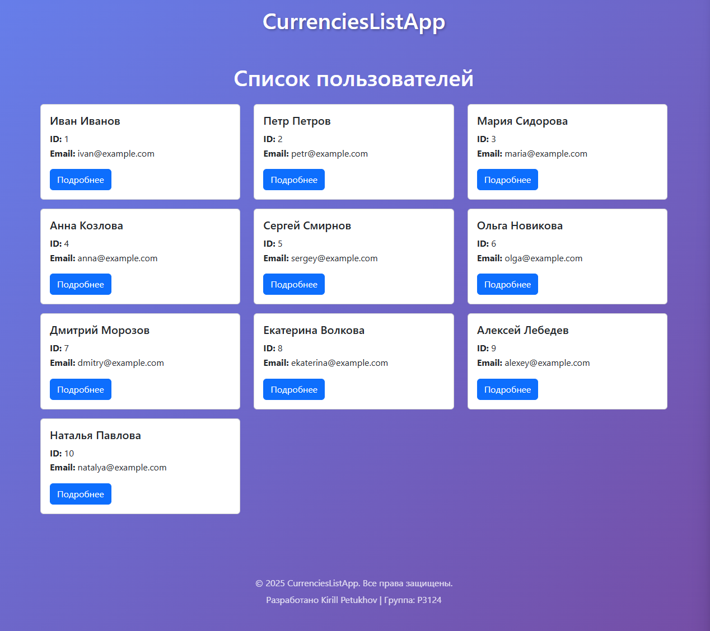
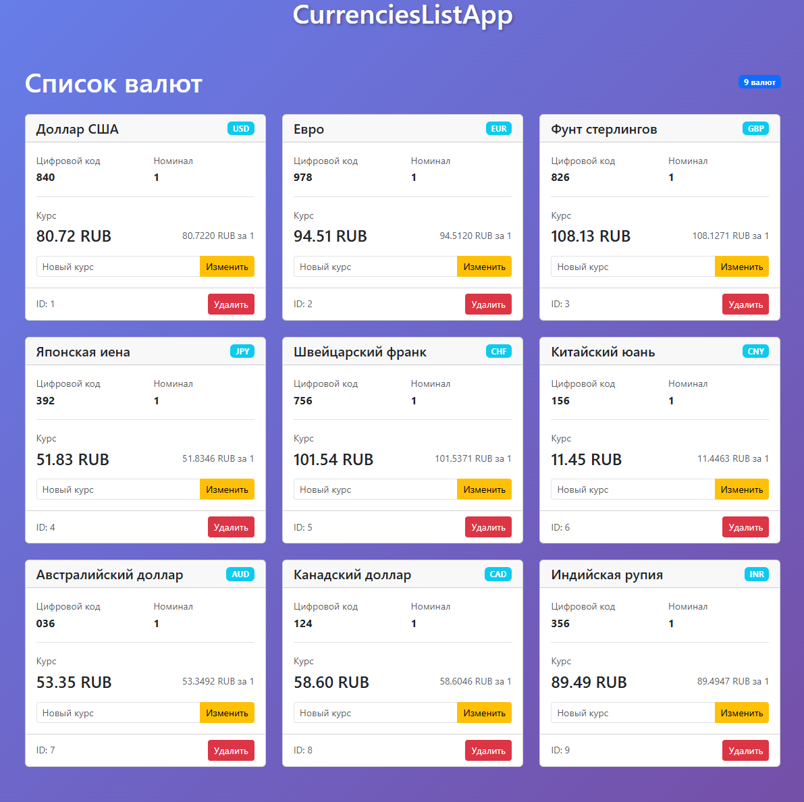
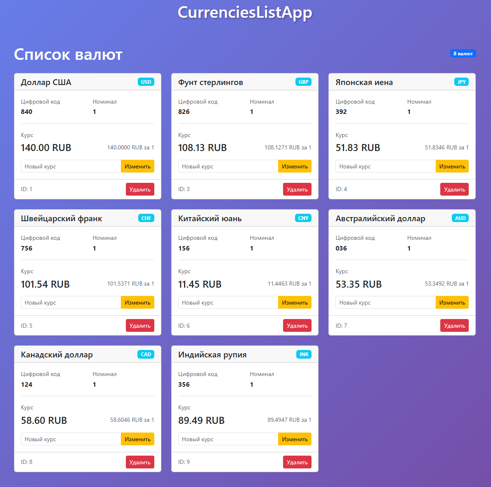
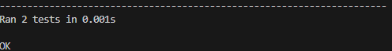

# Лабораторная работа 9. CRUD для приложения отслеживания курсов валют c SQLite базой данных 

# Лабораторная работа 8. Клиент-серверное приложение на Python с использованием Jinja2 #

## 1. Цель работы
* Реализовать CRUD (Create, Read, Update, Delete) для сущностей бизнес-логики приложения.
* Освоить работу с SQLite в памяти (:memory:) через модуль sqlite3.
* Понять принципы первичных и внешних ключей и их роль в связях между таблицами.
* Выделить контроллеры для работы с БД и для рендеринга страниц в отдельные модули.
* Использовать архитектуру MVC и соблюдать разделение ответственности.
* Отображать пользователям таблицу с валютами, на которые они подписаны.
* Реализовать полноценный роутер, который обрабатывает GET-запросы и выполняет сохранение/обновление данных и рендеринг страниц.
* Научиться тестировать функционал на примере сущностей currency и user с использованием unittest.mock.

## 2. Описание предметной области и моделей
В работе используются три основные сущности с четко определенными связями:

1.  **User (Пользователь)**
    *   `id` (INTEGER, PRIMARY KEY, AUTOINCREMENT) - уникальный идентификатор.
    *   `name` (TEXT, NOT NULL) - имя пользователя.

2.  **Currency (Валюта)**
    *   `id` (INTEGER, PRIMARY KEY, AUTOINCREMENT) - уникальный идентификатор.
    *   `num_code` (TEXT, NOT NULL) - цифровой код валюты (например, "840").
    *   `char_code` (TEXT, NOT NULL) - символьный код (например, "USD").
    *   `name` (TEXT, NOT NULL) - название валюты (например, "Доллар США").
    *   `value` (FLOAT) - текущий курс.
    *   `nominal` (INTEGER) - номинал.

3.  **UserCurrency (Подписка)**
    *   `id` (INTEGER, PRIMARY KEY, AUTOINCREMENT) - уникальный идентификатор связи.
    *   `user_id` (INTEGER, NOT NULL, FOREIGN KEY) - ссылка на пользователя.
    *   `currency_id` (INTEGER, NOT NULL, FOREIGN KEY) - ссылка на валюту.

**Связи**: Сущность `UserCurrency` реализует связь "многие-ко-многим" между `User` и `Currency`. Один пользователь может быть подписан на множество валют, и одна валюта может быть в списках многих пользователей. Первичные ключи (`PRIMARY KEY`) обеспечивают уникальность записей, а внешние ключи (`FOREIGN KEY`) гарантируют целостность данных: нельзя подписать пользователя на несуществующую валюту или удалить валюту, на которую есть активные подписки.


## 3. Структура проекта
myapp/ \
├── controllers/ #Контроллеры \
│ ├── \_\_init\_\_.py \
│ ├── currency_controller.py \
│ └── database_controller.py \
├── models/ #Модели \
│ ├── \_\_init\_\_.py \
│ ├── author.py \
│ ├── app.py \ 
│ ├── user.py \
│ ├── currency.py \
│ └── user_currency.py \
├── templates/ #Шаблоны View \
│ ├── components/ \
│ │ ├── author.html \
│ │ ├── currencies.html \
│ │ ├── footer.html \
│ │ ├── header.html \
│ │ ├── main.html \
│ │ ├── user.html \
│ │ └── users.html \
│ ├── components/ \
│ │ ├── author_page.html \
│ │ ├── currencies_page.html \
│ │ ├── main_page.html \
│ │ ├── user_page.html \
│ │ └── users_page.html \
│ └── index.html \
├── tests/unittests/ #Тесты \
│ ├── currency_controller_test.py \ 
│ └── models_test.py \
├── utils/ #Вспомогательные скрипты \
│ └── currencies_api.py.py \
├── myapp.py #Входная точка и маршрутизатор \
├── pages.py #Контроллер и обработчик страниц \
└── README.md \

## 4. Реализация CRUD-операций с SQLite

### 4.1 Работа с базой данных
Для изоляции данных между запусками используется база данных в памяти (`:memory:`). Инициализация схемы происходит при старте приложения.

### 4.2 Контроллер работы с БД (Database Controller)
Выделен отдельный модуль `database_controller.py`, отвечающий за выполнение параметризованных SQL-запросов. Это предотвращает SQL-инъекции и централизует логику доступа к данным.


## 5. Скриншоты работы приложения
### /

### /users

### /user?id=1

### /author

### /currencies

### /currencies (изменение курса доллара и удаление евро)



## 6. Примеры тестов с unittest.mock и результаты их выполнения
```python
class TestCurrencyController(unittest.TestCase):

    def test_list_currencies(self):
        mock_db = MagicMock()
        mock_db._read.return_value = [
            {"id": 1, "num_code": "840", "char_code": "USD", "name": "Доллар США", "value": 80.722, "nominal": 1}
        ]

        controller = CurrencyController(mock_db)
        result = controller.list_currencies()

        self.assertEqual(result[0].char_code, "USD")
        mock_db._read.assert_called_once()

    def test_update_currency(self):
        mock_db = MagicMock()
        controller = CurrencyController(mock_db)

        controller.update_currency("USD", 90)
        mock_db._update.assert_called_once_with({"USD": 90.0})
```



## Выводы
В ходе лабораторной работы было успешно модернизировано приложение для отслеживания курсов валют, переведя его с хранения данных в памяти на использование реляционной базы данных `SQLite`. \

Четкое разделение на модели, контроллеры (бизнес-логики, БД и страниц) и представления значительно повысило читаемость и поддерживаемость кода. Изменения в одном компоненте (например, логике БД) минимально затрагивают другие. \

Освоено создание схемы БД с использованием первичных и внешних ключей для обеспечения целостности данных. Параметризованные запросы стали стандартом для всех операций, что исключает уязвимости к SQL-инъекциям. \

Приложение теперь обладает полным набором операций над данными. Роутер в `myapp.py` эффективно обрабатывает различные запросы и координирует работу контроллеров. \

Использование `unittest.mock` позволило изолированно тестировать бизнес-логику, не завися от реальной базы данных. Это ускоряет выполнение тестов и делает их более стабильными. \

В результате было создано веб-приложение, демонстрирующее ключевые принципы backend-разработки: работу с БД, безопасность, чистую архитектуру и покрытие кода тестами.